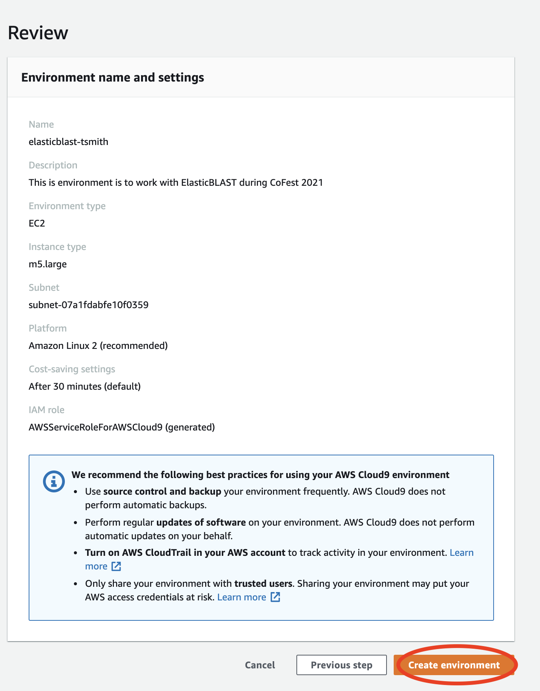

# ElasticBLAST at BOSC Collaboration Fest 2021

## 1 - Log in & Navigate to the AWS Console Page

1) Find your credential email with subject: **NCBI Codethon Credentials**


2) Navigate to [https://codeathon.ncbi.nlm.nih.gov](https://codeathon.ncbi.nlm.nih.gov) and login using the credentials from the email *(left image)* and create a new password after logging in *(right image)*


3) Click **Sign-In** under the AWS Console Sign-In column on the new page


4) If you see **AWS Management Console** like the screenshot below, you have successfully logged in to the AWS Console!


> **NOTE:** If you are logged out or get kicked out of the console, simply return to [https://codeathon.ncbi.nlm.nih.gov](https://codeathon.ncbi.nlm.nih.gov) and log in again (remember your newly created password!) to get back to the console home page.

> **NOTE:** This login method is unique to the workshop. If you want to create your own account after the workshop, visit the link below and follow the steps:
> [https://aws.amazon.com/premiumsupport/knowledge-center/create-and-activate-aws-account/](https://aws.amazon.com/premiumsupport/knowledge-center/create-and-activate-aws-account/)

## 2 - Open AWS Cloud9

We recommend you use the [AWS Cloud9](https://aws.amazon.com/cloud9/) as an integrated development environment
to work with ElasticBLAST.

1) Navigate to Cloud9 in the AWS Management Console.


Markdown is a lightweight and easy-to-use syntax for styling your writing. It includes conventions for

2) Create a new Cloud9 environment


3) Configure the Cloud9 environment. We recommend you name it
`elasticblast-USERNAME`, where `USERNAME` is your first initial followed by
your last name.


4) Select the `m5.large` instance type


5) Review the configuration settings and click on "Create environment"



## 3 -  Try the quick start

Next we recommend you try the [ElasticBLAST quick
start](https://blast.ncbi.nlm.nih.gov/doc/elastic-blast/quickstart-aws.html)
on AWS Cloud9.

## 4 -  Ideas to try

Here are a few ideas to work on during the CollaborationFest:

* Try it out and let us know how it works
* Help us improve the [documentation](https://blast.ncbi.nlm.nih.gov/doc/elastic-blast).
* Write a script to make ElasticBLAST part of your workflow.
* Example query sequence to try: all hepatis virus B sequences: s3://elasticblast-test/queries/hepatitis.fsa.gz
* Try to process ElasticBLAST results with cloud-native tools (see [this
  article](https://medium.com/codex/blast-on-the-cloud-with-ncbis-elasticblast-3b35b29afde7) for an example). 
* Bring your own high throughput BLAST search problem to use with ElasticBLAST! Please discuss it with us first to make sure you don’t blow our budget and get the ElasticBLAST team in trouble!

## 5 - Tips

1. Please use the `--loglevel DEBUG` command line option for greater diagnostics to be saved into the log file `elastic-blast.log`.
1. `elastic-blast submit` has a `--dry-run` option that does some configuration validation and logs what would be done.
1. Run your ElasticBLAST search with a subset of the query sequence data you intend to work with as a first try, then observe the performance.
1. Label your ElasticBLAST searches, e.g.: set `owner=LASTNAME` as described in the [documentation](https://blast.ncbi.nlm.nih.gov/doc/elastic-blast/configuration.html#cloud-resource-labels).
1. You can easily search and filter AWS EC2 instance types in [https://ec2instances.info](https://ec2instances.info).

## 6 - Schedule

| Event | Time UTC | Time EST|
|-------|----------| -------|
| Roundtable at BOSC NCBI Posters and Collaboration Fest| July 29, 2021 14:00 | July 29, 2021 10:00 |
| ElasticBLAST poster presentation | July 29, 2021 15:20 | July 29, 2021 11:20 |
| Collaboration Fest Kickoff | July 30, 2021 19:00? | July 30, 2021 15:00  |
| Office hours | July 31, 2021 14:00  | July 31, 2021 10:00 |
| Office hours | July 31, 2021 18:00  | July 31, 2021 14:00 |
| Office hours | August 1, 2021 14:00 | August 1, 2021 10:00 |
| Feedback session | August 1, 2021 17:00  | August 1, 2021 13:00 |
| Closing presentation | August 1, 2021 19:00  | August 1, 2021 15:00 |

##  Office hours

Please see the times in the schedule above during which you can find us for questions/comments.

##  Support or Contact

The ElasticBLAST team will be reachable via [the Slack BOSC CoFest 2021 channel](https://obf-bosc.slack.com/archives/C01M9N7B02E). 

To help us help you better, when reporting problems, please provide us with:

1. Your configuration file
2. The ElasticBLAST logfile (`elastic-blast.log` by default)
3. Your system’s information, i.e. the output of the commands below:

```markdown
# It' is OK if any of these commands fail ;)
uname -a
python3 -m sysconfig
env

aws sts get-caller-identity
aws configure list
aws cloudformation describe-stack-events --stack-name $(awk '/name.:/ {print $NF}' elastic-blast.log | tr -d ",'" | tail -1) --region $(awk '/region.:/ {print $NF}' elastic-blast.log | tr -d ",}'" | tail -1) --output json
```
